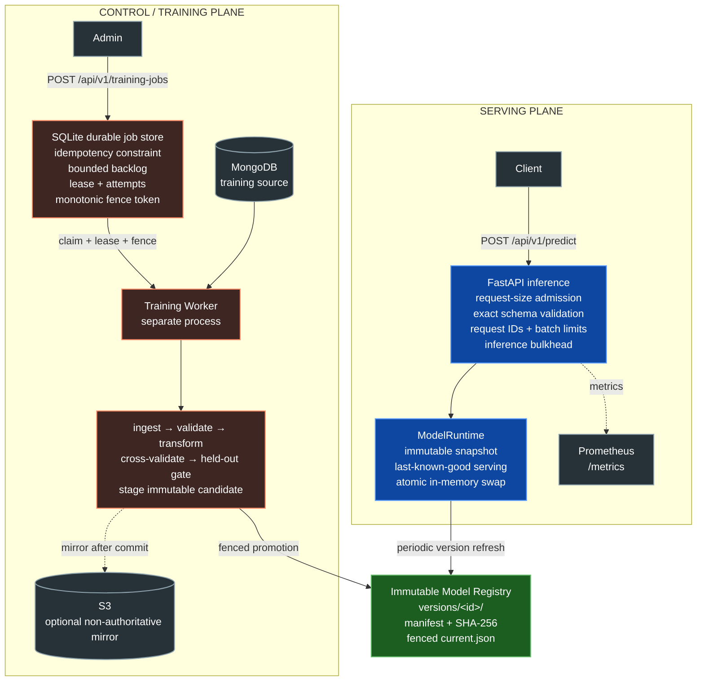
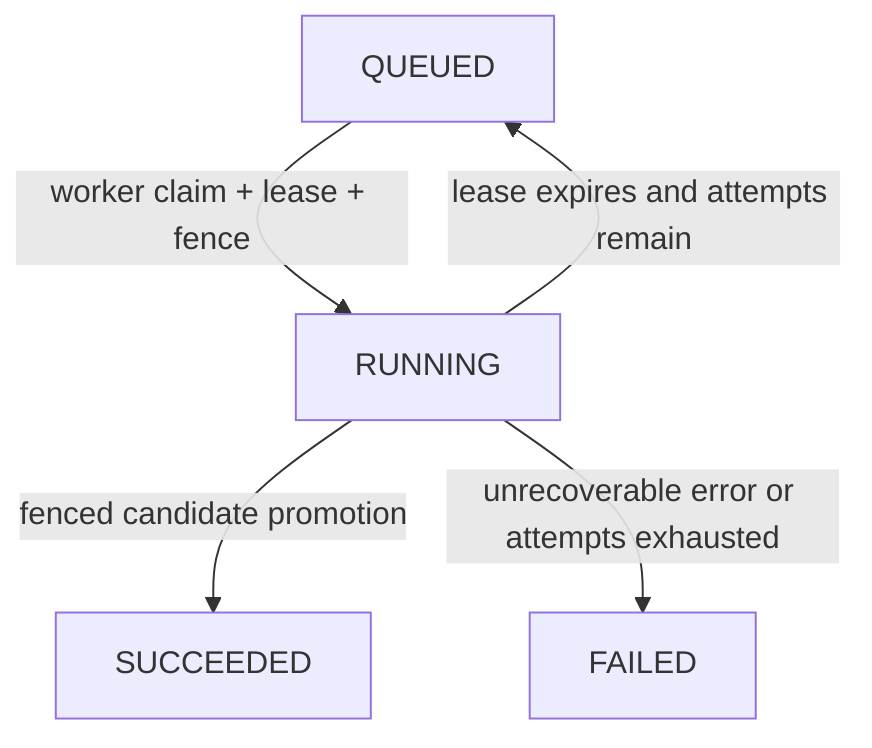

# Network Security Decision Platform

[](https://github.com/BackendArchitectX/networksecurity/actions/workflows/main.yml)

A production-minded Python backend for **versioned threat scoring, durable retraining orchestration, and fenced model promotion**.

The classifier is one component, not the architecture. The engineering focus is the contract around it: bounded request and inference admission, durable idempotent jobs, worker leases, monotonic fencing tokens, immutable model bundles, checksum and schema verification, last-known-good serving, explicit health semantics, observability, container isolation, and documented failure boundaries.

## Code tour

If you want to understand the project quickly, start here:

1. [`networksecurity/api/app.py`](networksecurity/api/app.py) — HTTP contracts, health semantics, authenticated control-plane endpoints, request IDs, metrics and background model refresh.
2. [`networksecurity/api/middleware.py`](networksecurity/api/middleware.py) — streamed request-body admission that does not trust `Content-Length`.
3. [`networksecurity/services/model_runtime.py`](networksecurity/services/model_runtime.py) — bounded inference, schema-compatible model loading, atomic in-memory swap and last-known-good serving.
4. [`networksecurity/services/model_registry.py`](networksecurity/services/model_registry.py) — immutable model/preprocessor bundles, SHA-256 verification and fenced `current.json` promotion.
5. [`networksecurity/services/training_jobs.py`](networksecurity/services/training_jobs.py) + [`training_worker.py`](networksecurity/services/training_worker.py) — durable idempotency, bounded backlog, worker leases, fencing tokens, retries and crash recovery.
6. [`networksecurity/components/model_trainer.py`](networksecurity/components/model_trainer.py) — cross-validated classifier selection and held-out F1 promotion gate.
7. [`docs/DESIGN_REVIEW.md`](docs/DESIGN_REVIEW.md) — the design decisions that carry most of the backend-system reasoning.

## System architecture



The API and training worker are separate deployable processes. Expensive retraining never executes on an inference request thread or inside the serving process.

## Engineering invariants

These are implemented properties of the current architecture:

- **No torn model/preprocessor release.** Training writes candidate artifacts into a run-scoped location. Only an accepted model and its matching preprocessor are copied into one immutable version bundle.
- **Training and promotion are separate.** A worker may finish expensive training after losing its lease, but it cannot make that candidate active unless it still owns the current `(job, worker, fence)` generation.
- **Stale workers are fenced out.** Every claim gets a globally monotonic fence token. Lease-sensitive mutations require the exact token, and `current.json` also records the promotion token so an older generation cannot overwrite a newer model pointer.
- **Promotion is pointer-based.** A complete version directory is committed before `current.json` is atomically replaced. Readers observe an old complete bundle or a new complete bundle rather than partially updated files.
- **Artifacts are verified before deserialization.** Bundle paths are constrained to the registry, SHA-256 digests are checked, and the published schema fingerprint plus feature order must match the serving schema before pickle loading occurs.
- **Failed reload preserves availability.** The runtime loads a candidate snapshot completely before swapping the active reference. Corrupt or incompatible versions cannot evict the last-known-good model.
- **Inference admission is bounded.** CPU-heavy prediction is protected by a semaphore and fails fast with `429` when the configured concurrency budget cannot be acquired.
- **Request admission is bounded even without `Content-Length`.** An ASGI receive wrapper counts streamed bytes, so chunked bodies cannot bypass the application request-size limit.
- **Training submission is durable and idempotent.** The idempotency key is protected by a SQLite unique constraint and survives API restarts.
- **Training jobs are leased.** A worker owns a job for a bounded lease, heartbeats while processing, and abandoned work can be reclaimed after expiry.
- **Liveness is not readiness.** The process may be operational while no compatible model is loaded. `/health/live` stays available while `/health/ready` returns `503`.
- **Model selection does not tune against the test set.** Candidate selection uses stratified cross-validated F1 on training data; held-out test data is evaluated after selection and gates promotion.
- **Train/test diagnostics are not called production drift.** Distribution comparisons between random partitions are recorded only as non-gating diagnostics. Production drift requires a reference/production feedback path that this repository does not pretend to implement.

## Failure semantics

| Failure | Service behavior |
|---|---|
| No active model version | process stays live; readiness is `503` |
| Missing/unexpected feature | request rejected with `422` before inference |
| Non-finite feature | request rejected with `422` |
| Request body exceeds limit | `413`, including streamed/chunked bodies |
| Batch exceeds configured record limit | `413` |
| Inference bulkhead saturated | `429` instead of unbounded queuing |
| Duplicate training submission | existing durable job is returned |
| Durable training backlog full | `429` |
| Worker dies during training | lease eventually expires; job can be reclaimed up to the configured attempt limit |
| Stale worker finishes after lease loss | candidate may exist, but fenced promotion is rejected |
| Candidate fails F1 gate | no model registry promotion |
| Published artifact checksum mismatch | reload rejected; current serving snapshot remains active |
| Published schema fingerprint mismatch | reload rejected; current serving snapshot remains active |
| Background model refresh fails | error is observed; last-known-good snapshot continues serving |
| Admin API disabled | administrative endpoints return `503` |
| Invalid admin key | `401` |

## API

| Method | Endpoint | Purpose |
|---|---|---|
| `GET` | `/health/live` | process liveness |
| `GET` | `/health/ready` | serving readiness and active model metadata |
| `GET` | `/api/v1/model` | immutable active model identity |
| `POST` | `/api/v1/predict` | strict-schema single inference |
| `POST` | `/api/v1/predict/batch` | bounded batch inference |
| `POST` | `/api/v1/model/reload` | authenticated immediate registry refresh |
| `POST` | `/api/v1/training-jobs` | authenticated durable retraining submission |
| `GET` | `/api/v1/training-jobs/{job_id}` | durable job state, attempt count and resulting model version |
| `GET` | `/metrics` | Prometheus metrics |

Prediction responses include the request ID and exact model version that produced the decision, making model identity part of the serving contract rather than hidden process state.

## Durable training workflow



Submit work with a stable idempotency key describing the retraining intent:

```bash
curl -X POST http://localhost:8080/api/v1/training-jobs \
  -H "X-Admin-Api-Key: $ADMIN_API_KEY" \
  -H 'Idempotency-Key: phishing-model-refresh-2026-09-11'
```

The HTTP request only commits queue state. A separate worker claims and executes the job.

## Immutable model registry

A promoted version is shaped like:

```text
model_registry/
├── current.json
└── versions/
    └── 20260911T...-<id>/
        ├── manifest.json
        ├── model.pkl
        └── preprocessor.pkl
```

`manifest.json` records artifact SHA-256 digests and metadata including the schema fingerprint and ordered feature contract. The serving runtime validates the bundle before constructing a new in-memory snapshot.

A candidate version is staged first without changing production. `current.json` is intentionally tiny and includes a monotonic promotion token. Promotion happens only through the durable job store while the worker still owns the matching lease/fence generation, and an older promotion token cannot overwrite a newer pointer.

The optional S3 copy is a mirror, not serving authority. It happens after local promotion; mirror failure is observed but does not roll back an already committed local release.

## Serving / training isolation

Two dependency graphs and two images are maintained:

- `requirements.txt` + `Dockerfile` contain only inference/runtime dependencies.
- `requirements-training.txt` + `Dockerfile.worker` add MongoDB, MLflow, scipy and AWS dependencies required by training.

Direct dependencies are pinned to the versions exercised by CI, and both containers use a pinned Python patch-level base image. This reduces dependency drift; a future release can tighten this further with a generated transitive lockfile or image digest policy.

Run the local topology with:

```bash
cp .env.example .env
# configure ADMIN_API_KEY and MONGO_DB_URL

docker compose up --build
```

The API and worker share only the durable job store and model registry volumes.

The historical raw CSV is intentionally not redistributed because its original provenance and redistribution terms were not documented sufficiently. Supply a compatible dataset that you are permitted to use:

```bash
export MONGO_DB_URL='mongodb://...'
python scripts/seed_mongodb.py --file /path/to/phishing-data.csv --replace
```

See [`docs/DATASET.md`](docs/DATASET.md) for the schema/provenance contract. The default local database and collection are `networksecurity.network_events`; both can be overridden through environment variables or command-line options.

## Model-selection correctness

Candidate algorithms are tuned with `StratifiedKFold` using F1 as the selection metric. The test split is not part of hyperparameter/model selection. After the winning candidate is chosen, held-out F1, precision and recall are calculated and the configured `MODEL_MIN_F1` threshold must pass before publication.

No performance or accuracy number is claimed in this README without a reproducible run. The repository includes a load-test harness under `benchmarks/`; benchmark output should be captured for a specific machine, container, payload and model version before being quoted.

## Observability

Structured JSON logs are emitted to stdout. Prometheus metrics include:

- request count by bounded-cardinality route template, method and status
- request latency
- inference latency
- in-flight inference work
- model readiness
- model reload outcomes

`X-Request-Id` is accepted or generated for every request. Responses also use `Cache-Control: no-store` and `X-Content-Type-Options: nosniff`.

## CI quality gates

GitHub Actions installs the project itself, compiles production code, runs correctness-focused Ruff rules, executes branch-aware coverage over the **entire `networksecurity` package** with a 75% floor, verifies dependency consistency, audits serving dependencies and builds both non-root images with smoke-import checks.

```bash
python -m pip install -r requirements-training.txt -r requirements-dev.txt
python -m pip install --no-deps -e .
python -m compileall -q networksecurity app.py worker.py main.py
ruff check networksecurity app.py worker.py main.py scripts tests --select F,B
python -m pytest --cov=networksecurity --cov-branch --cov-fail-under=75
pip-audit -r requirements.txt

docker build -t networksecurity-api .
docker build -f Dockerfile.worker -t networksecurity-worker .
```

## Design evolution

The current architecture is the result of removing coupling and making failure semantics explicit:

- synchronous retraining inside the web process became a separate worker and durable job contract
- mutable `final_model/` files became immutable staged bundles plus a fenced promotion pointer
- process-local training state became restart-safe SQLite idempotency, leases and monotonic claim generations
- lease ownership alone became fenced side-effect ownership so stale workers cannot publish after reclaim
- header-only request sizing became streamed byte accounting at the ASGI boundary
- generic “accuracy” naming became an explicit held-out F1 promotion threshold
- model identity became part of every prediction response rather than hidden deployment state

Those changes are more important than adding more infrastructure: each one makes a concrete failure mode observable, bounded or recoverable.

## What this implementation deliberately does not claim

This is the line between a defensible engineering project and architecture theater.

- **SQLite is not a proposed multi-region control plane.** It demonstrates durable idempotency, leases, fencing, crash recovery and process separation on one host/shared filesystem. A real multi-node deployment should move the job contract behind PostgreSQL plus a durable queue, or an equivalent managed design.
- **The filesystem registry is not a global artifact service.** It demonstrates immutable bundles and atomic local promotion. A distributed deployment should use an object-store/registry adapter with versioned artifacts and an authoritative promotion record or event.
- **SQLite + filesystem is not a distributed transaction.** Fencing prevents stale-worker overwrite, but a process crash at the exact cross-resource commit boundary can still require reconciliation. A production release controller should use an authoritative promotion record/outbox.
- **An API key is not the final internet-facing identity model.** Production administrative APIs should use workload identity or OAuth/JWT plus network policy.
- **Pickle is a trusted-artifact boundary.** Checksums protect corruption, not authenticity against an attacker who can rewrite both the artifact and manifest. Registry write access must remain trusted; a hardened distributed registry should add signed provenance or a safer serialization format.
- **The KS split diagnostic is not concept drift.** Production drift requires telemetry from actually served traffic and, for concept drift, post-decision labels.
- **No synthetic scalability claim is made.** Use the included benchmark harness and record hardware, concurrency, payload and model version with every result.

## Production evolution

The current contracts are shaped so infrastructure can be replaced without rewriting clients: `TrainingJobStore` can become PostgreSQL plus SQS/Kafka-backed orchestration; monotonic fences can move with the authoritative job record; `ModelRegistry` can become an object-store registry; the refresh loop can become event-driven promotion notification; admin authentication can move to workload identity; and serving replicas can remain stateless apart from their immutable in-memory model snapshot.

See [`docs/ARCHITECTURE.md`](docs/ARCHITECTURE.md), [`docs/OPERATIONS.md`](docs/OPERATIONS.md), [`docs/FAILURE_MODES.md`](docs/FAILURE_MODES.md), [`docs/DESIGN_REVIEW.md`](docs/DESIGN_REVIEW.md), [`docs/DATASET.md`](docs/DATASET.md), and the ADRs under [`docs/adr/`](docs/adr/) for the reasoning and failure trade-offs.

## Repository map

```text
networksecurity/
├── api/                     # HTTP contracts, admission middleware, service composition
├── config/                  # immutable environment-driven runtime settings
├── services/
│   ├── model_registry.py    # immutable bundles + fenced version pointer
│   ├── model_runtime.py     # last-known-good serving snapshot + bulkhead
│   ├── training_jobs.py     # durable idempotent leased/fenced queue
│   └── training_worker.py   # isolated job execution
├── components/              # ingestion, validation, transformation, candidate training
├── pipeline/                # candidate orchestration, staging and promotion
├── cloud/                   # optional S3 artifact adapter
└── entity/                  # immutable pipeline artifacts

tests/                       # failure, concurrency, lifecycle and API contract tests
benchmarks/                  # reproducible load-test harness
docs/                        # architecture, operations, dataset contract and ADRs
```

## Scope

A phishing-classification workload is used to exercise the backend architecture, but raw training data is not redistributed without verified provenance and licensing. This repository is not presented as a production IDS/IPS or SOC product. Its purpose is to demonstrate how a model-backed decision service can be explicit about **concurrency, durability, versioning, fenced promotion, rollback, observability and failure behavior**.

## License

Project code is licensed under the [MIT License](LICENSE). Training datasets are separate inputs and are not covered by the code license unless their own terms explicitly say so.
