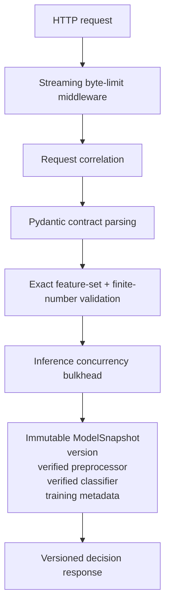
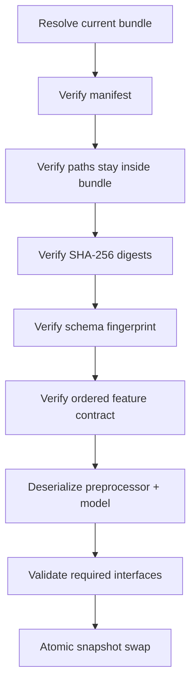
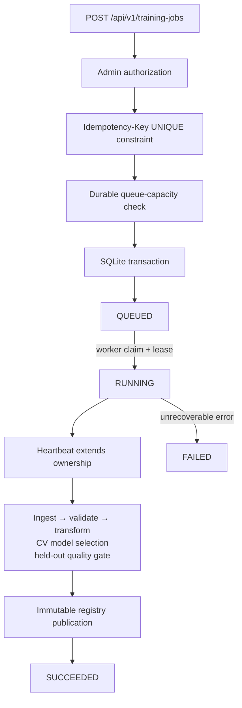
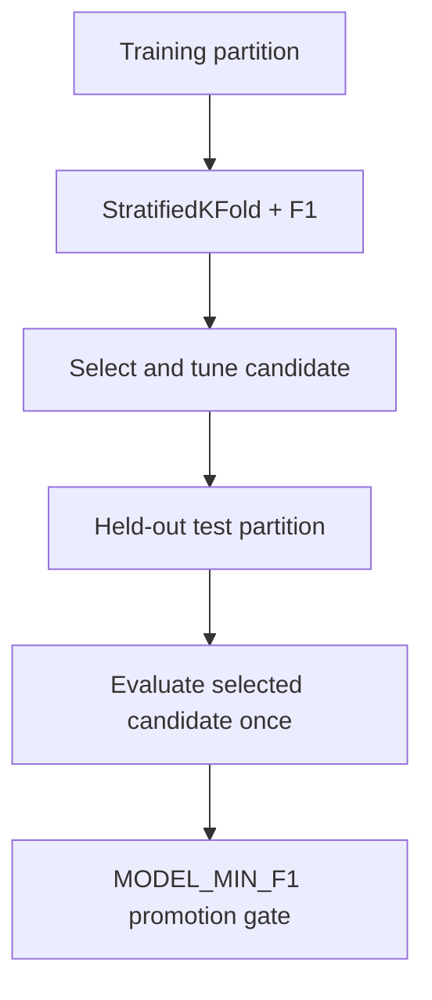

# Architecture

## Design objective

The system is organized around a simple constraint: **model training must never be allowed to compromise inference availability or produce an ambiguous model release**.

That leads to four explicit boundaries:

1. **Serving plane** — bounded synchronous inference against one immutable in-memory snapshot.
2. **Durable control plane** — persistent idempotent job state and worker ownership.
3. **Training worker** — expensive ingestion/training execution in a separate process and dependency graph.
4. **Model registry** — immutable model/preprocessor bundles promoted through one atomic pointer.

## Request path



The request path does not import MongoDB, MLflow, boto3, the training pipeline, or the worker.

## Request admission

There are two distinct overload controls.

### Body-size admission

`RequestBodyLimitMiddleware` counts bytes from the ASGI receive stream rather than trusting only `Content-Length`. This matters because HTTP/1.1 chunked requests or intermediaries may not provide a reliable content-length header.

The edge proxy should still enforce a matching or stricter body limit. The application limit is the second line of defense and part of application correctness.

### Inference bulkhead

The model runtime uses a bounded semaphore. Requests wait only for `INFERENCE_ACQUIRE_TIMEOUT_MS`. If all inference capacity remains occupied, the request fails with `429` rather than joining an unbounded application queue.

The intent is to preserve useful throughput and bounded latency under overload rather than maximizing admission.

## Immutable serving snapshots

The serving thread never reads model files during prediction. It captures a reference to the current `ModelSnapshot`, then performs preprocessing and prediction through that immutable object graph.

Reload is copy-on-swap:



Artifact I/O and deserialization happen before the swap. An exception therefore leaves the previous snapshot reachable by all new requests.

Concurrent reload attempts are serialized separately from inference. Inference does not hold the reload lock.

## Model registry

The local reference registry uses this shape:

```text
model_registry/
├── current.json
└── versions/
    └── <immutable-version>/
        ├── manifest.json
        ├── model.pkl
        └── preprocessor.pkl
```

Publication is staged in a temporary directory. The manifest and artifacts are flushed, the staging directory is atomically renamed to the final immutable version, and only then is `current.json` replaced.

The manifest contains artifact hashes and model metadata. The metadata includes the SHA-256 fingerprint of the serving schema and the ordered feature list. A bundle trained for a different feature contract cannot become the active in-memory snapshot.

### Why a pointer instead of overwriting model.pkl?

Overwriting multiple production files creates a torn-release window: a reader may observe a new preprocessor with an old classifier, or vice versa. A pointer to an immutable release reduces promotion to one small atomic state transition.

## Training control plane

The API commits training intent to `TrainingJobStore`; it does not execute training.



Idempotency therefore survives API restarts. The same idempotency key resolves to the original durable job rather than merely deduplicating in one Python process.

## Worker leases and crash recovery

A RUNNING job contains a `worker_id`, `lease_until`, and attempt count. The worker heartbeats while training.

When another worker polls:

- an unexpired RUNNING job prevents any second job from being claimed;
- an expired job below the maximum attempt count is returned to QUEUED;
- an expired job that has exhausted its attempts becomes FAILED.

The queue transaction uses `BEGIN IMMEDIATE`, so competing local workers cannot both claim the same job.

The current filesystem registry is intentionally single-writer. Even if several worker processes poll, only one unexpired training job is allowed to be RUNNING at once. This is a design constraint, not an accidental limitation.

## Candidate versus production artifacts

Training components only write run-scoped candidate artifacts under `Artifacts/<run-id>/`. `DataTransformation` does not mutate production state. `ModelTrainer` does not mutate production state.

Only after model selection and the held-out F1 gate succeed does `TrainingPipeline.publish_model()` construct an immutable production bundle.

This distinction prevents a failed training run from partially changing serving artifacts.

## Model selection

The selection path is deliberately separated from final evaluation:



The test partition is not repeatedly consulted while choosing model families or hyperparameters.

## Data validation and drift terminology

Training validation can truthfully establish:

- exact declared columns
- no duplicate columns
- numeric/finite feature values
- non-empty data
- supported target labels

The repository also writes a KS comparison between the random train and test partitions. That file is explicitly a **split-consistency diagnostic** and does not gate training.

It is not called production drift. Production covariate drift requires a production/reference distribution. Concept drift additionally requires later labels or another outcome signal.

## Health model

`GET /health/live` asks whether the application process is functioning.

`GET /health/ready` asks whether the instance currently has a valid model snapshot and can serve model-backed traffic.

No model at startup is not treated as a process crash. This permits diagnostics and controlled rollout without routing inference traffic prematurely.

## Model propagation

The API runs a lightweight background registry refresh loop. It compares the registry's active version to its in-memory version and reloads only on change.

A failed refresh records an observability signal and leaves the old snapshot serving. Manual authenticated reload uses the same runtime path.

For the local two-process topology, the API and worker share a model-registry volume. S3 synchronization is an optional artifact mirror; the current serving runtime is not falsely presented as a globally distributed S3 registry consumer.

## Observability

The API exposes bounded-cardinality Prometheus metrics for HTTP counts/latency, inference latency, in-flight inference, model readiness, and model reload outcomes.

Raw IDs are not used as metric labels. Request identifiers belong in structured logs and response headers, avoiding time-series cardinality explosions.

## Security boundaries

The current implementation assumes model-registry write access is trusted. SHA-256 verifies integrity/corruption, not publisher authenticity when an attacker can rewrite both manifest and artifact. Because the model format is pickle, this trust boundary is explicit and important.

Other controls include non-root containers, separated serving/training dependency graphs, disabled-by-default admin operations, constant-time API-key comparison, exact request/body limits, schema compatibility checks, environment-provided secrets, and no-store response semantics.

A production external control plane should replace the API key with workload identity or OAuth/JWT and should use signed model provenance or a safer model serialization policy.

## Scaling boundary

The current SQLite + shared-filesystem implementation is a **single-host durable reference architecture**. It demonstrates the semantics before introducing distributed infrastructure.

| Current reference adapter | Production evolution |
|---|---|
| SQLite job store | PostgreSQL + SQS/Kafka/managed queue |
| Filesystem registry | Object-store/model-registry adapter |
| Polling refresh | Promotion event / watch mechanism |
| Admin API key | Workload identity + policy |
| Shared local volume | Durable object storage |

The important part is that idempotency, lease ownership, immutable versions, compatibility validation and last-known-good serving remain explicit when those adapters change.
