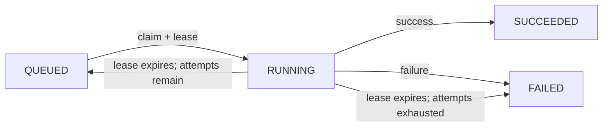

# Design Review

This document captures the five backend decisions that carry most of the system reasoning. Each section states the invariant, where it is implemented, the failure mode it addresses, and what would change in a larger deployment.

## 1. Inference bulkhead and overload behavior

**Invariant:** inference concurrency is bounded. The service never accepts unlimited CPU-bound model work into an invisible queue.

**Code:**
- `networksecurity/services/model_runtime.py`
- `networksecurity/api/app.py`

`ModelRuntime` protects prediction with a `BoundedSemaphore`. A request waits only for `INFERENCE_ACQUIRE_TIMEOUT_MS`; if capacity is still unavailable, the runtime raises `InferenceBusyError` and the API returns `429`.

Why this matters: an async HTTP server can accept far more concurrent sockets than a CPU-bound classifier can execute efficiently. Without admission control, a traffic spike converts into thread pressure, memory growth and extreme tail latency. Failing fast under saturation preserves the health of requests that are already in flight.

What this does **not** solve: it is a per-process bulkhead. A horizontally scaled service needs capacity management at the fleet level as well, usually through autoscaling, upstream rate limiting and load-shedding policy.

## 2. Durable idempotent training submission

**Invariant:** retrying the same administrative training intent does not start duplicate expensive work, and the deduplication record survives API restarts.

**Code:**
- `networksecurity/services/training_jobs.py`
- `networksecurity/api/app.py`

The client provides an `Idempotency-Key`. SQLite enforces uniqueness in the database rather than relying on an in-memory map. Submission uses `BEGIN IMMEDIATE`, checks the active backlog, and inserts the job and idempotency record atomically within the same transaction.

Why this matters: administrative clients, operators and proxies retry requests. Retraining is expensive and has side effects, so retry safety must be part of the API contract rather than a caller convention.

Why SQLite here: it is enough to demonstrate restart-safe durability, uniqueness, transactional admission and leases while keeping the project inspectable. It is deliberately not presented as a multi-node queue.

Production evolution: persist job/idempotency state in PostgreSQL or another transactional store and execute work through SQS, Kafka, a managed task system or equivalent. The HTTP idempotency contract can remain unchanged.

## 3. Worker leases and crash recovery

**Invariant:** a worker owns a training job only while its lease is valid. Dead workers do not leave work permanently stuck in `RUNNING`.

**Code:**
- `networksecurity/services/training_jobs.py`
- `networksecurity/services/training_worker.py`

A worker claims the oldest queued job, records its `worker_id`, increments `attempts`, and receives a bounded lease. A heartbeat extends that lease while training is active. On the next claim transaction, expired jobs are either requeued or failed after the configured attempt limit.

The state machine is:

Why this matters: process death, host restart and network/storage faults are normal operational events. A durable job system needs ownership with expiry, not a permanent boolean `running` flag.

Important limitation: lease recovery creates **at-least-once execution**. A worker can lose its lease after doing external work but before recording completion. Therefore downstream publication must be safe against retries and stale ownership. The current single-writer reference deployment reduces this surface, but a distributed implementation should add promotion fencing or an authoritative outbox/transactional promotion record.

## 4. Immutable model bundles and pointer-based promotion

**Invariant:** serving never observes a new preprocessor with an old model or vice versa.

**Code:**
- `networksecurity/services/model_registry.py`
- `networksecurity/pipeline/training_pipeline.py`

A successful candidate is published into a new immutable `versions/<version>/` directory containing:

- `model.pkl`
- `preprocessor.pkl`
- `manifest.json`

The manifest records SHA-256 digests plus schema/feature metadata. The directory is completed and fsynced before the small `current.json` pointer is atomically replaced with `os.replace`.

That ordering gives readers a simple rule: the pointer refers only to a complete version. A reader sees either the old complete bundle or the new complete bundle, never a partially updated release.

The optional S3 mirror follows the same logical order: immutable version contents first, pointer last.

What checksums provide: corruption detection.

What checksums do **not** provide: authenticity. An attacker with registry write access could replace both an artifact and its checksum. A hardened production registry should use signed provenance and tighter writer identity, or a safer artifact format.

## 5. Last-known-good model serving

**Invariant:** a corrupt or incompatible promoted candidate cannot evict a model that is already serving successfully.

**Code:**
- `networksecurity/services/model_runtime.py`
- `networksecurity/services/model_registry.py`

Reload is split into two phases:

1. Resolve and verify the candidate bundle outside the active-snapshot swap.
2. Validate schema fingerprint and ordered features, deserialize the artifacts, check required methods, then replace the in-memory snapshot under a short lock.

Inference captures the current immutable snapshot before model execution. Registry I/O and pickle deserialization therefore do not block prediction on the snapshot lock.

The background refresh loop polls the registry version. If refresh fails, the exception is logged and counted while the previous snapshot remains active. Readiness stays true as long as a valid prior snapshot exists.

Why this matters: deployment and configuration systems should degrade toward the last valid state rather than turning a bad release into an outage.

## Cross-cutting boundaries

### Liveness vs readiness

`/health/live` answers whether the process is alive. `/health/ready` answers whether the instance can serve model-backed requests. A process with no compatible model is live but not ready.

### Request-size enforcement

`RequestBodyLimitMiddleware` counts actual streamed ASGI body bytes. `Content-Length` is used only as an early rejection hint; clients cannot bypass the application limit by omitting or lying about the header.

### Model-selection correctness

Candidate algorithms are selected with stratified cross-validated F1 using training data. The held-out test split is consulted only after selection and is used as the final promotion gate.

### Serving/training process isolation

The serving image does not need MongoDB, MLflow, boto3 or training orchestration. The worker carries the training dependency graph. This lowers coupling and prevents expensive retraining from competing with inference for the same process lifecycle.

## What I would change for a multi-node production deployment

The current contracts are intentionally replaceable. The main changes would be:

1. Replace SQLite with PostgreSQL for authoritative job/idempotency state and a durable queue for execution.
2. Add fencing tokens or a transactional outbox so stale workers cannot publish after losing ownership.
3. Replace the filesystem registry with an object-store/model-registry adapter using immutable versions and a strongly controlled promotion record.
4. Replace admin API keys with workload identity or OAuth/JWT plus network policy.
5. Make model-promotion notification event-driven instead of polling.
6. Add production-traffic feedback and post-decision labels before claiming real covariate/concept drift detection.
7. Establish measured SLOs only after reproducible load and failure testing on a specified deployment topology.

The central design principle is unchanged: **make ownership, admission, version identity and failure behavior explicit at the service boundary rather than relying on process-local assumptions.**
